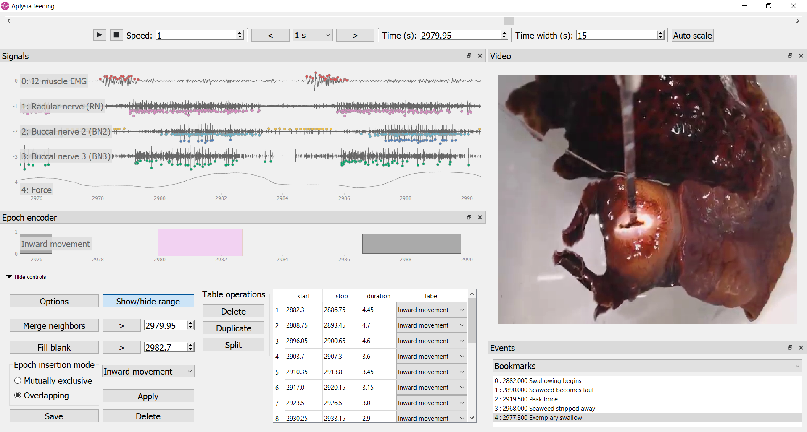

*neurotic*: NEUROscience Tool for Interactive Characterization
==============================================================

*Curate, visualize, annotate, and share your behavioral ephys data using Python*

|PyPI badge| |Anaconda badge| |GitHub badge| |Feedstock badge| |Constructor badge| |Docs badge| |GitHub Actions badge| |Azure badge| |Coverage badge| |Zenodo badge| |eNeuro badge|

**Version:** |version| (`other versions`_)

*neurotic* is an app for Windows, macOS, and Linux that allows you to easily
review and annotate your electrophysiology data and simultaneously captured
video. It is an easy way to load your Neo_-compatible data (see :mod:`neo.io`
for file formats) into ephyviewer_ without doing any programming. Share a
single metadata file with your colleagues and they too will quickly be looking
at the same datasets!

|Example screenshot|

.. toctree::
   :maxdepth: 2
   :hidden:
   :caption: Table of Contents

   overview
   install
   update
   gettingstarted
   citations
   metadata
   examples
   gdrive
   globalconfig
   api
   releasenotes

.. |PyPI badge| image:: https://img.shields.io/pypi/v/neurotic.svg?logo=python&logoColor=white
    :target: PyPI_
    :alt: PyPI project

.. |Anaconda badge| image:: https://img.shields.io/conda/vn/conda-forge/neurotic.svg?label=anaconda&logo=anaconda&logoColor=white
    :target: `Anaconda Cloud`_
    :alt: Anaconda Cloud project

.. |GitHub badge| image:: https://img.shields.io/badge/github-source_code-blue.svg?logo=github&logoColor=white
    :target: GitHub_
    :alt: GitHub source code

.. |Feedstock badge| image:: https://img.shields.io/badge/conda--forge-feedstock-blue.svg?logo=conda-forge&logoColor=white
    :target: `conda-forge feedstock`_
    :alt: conda-forge feedstock

.. |Constructor badge| image:: https://img.shields.io/badge/constructor-recipe-blue.svg
    :target: `constructor recipe`_
    :alt: constructor recipe

.. |Docs badge| image:: https://img.shields.io/readthedocs/neurotic/latest.svg?logo=read-the-docs&logoColor=white
    :target: ReadTheDocs_
    :alt: Documentation status

.. |GitHub Actions badge| image:: https://github.com/jpgill86/neurotic/workflows/tests/badge.svg?branch=master
    :target: `GitHub Actions`_
    :alt: Tests status

.. |Azure badge| image:: https://dev.azure.com/conda-forge/feedstock-builds/_apis/build/status/neurotic-feedstock?branchName=master
    :target: `conda-forge CI`_
    :alt: conda-forge build status

.. |Coverage badge| image:: https://coveralls.io/repos/github/jpgill86/neurotic/badge.svg?branch=master
    :target: Coveralls_
    :alt: Coverage status

.. |Zenodo badge| image:: https://img.shields.io/badge/DOI-10.5281/zenodo.3564990-blue.svg
    :target: Zenodo_
    :alt: Zenodo archive

.. |eNeuro badge| image:: https://img.shields.io/badge/DOI-10.1523/ENEURO.0085--20.2020-blue.svg
    :target: eNeuro_
    :alt: eNeuro article

.. _Anaconda Cloud: https://anaconda.org/conda-forge/neurotic
.. _constructor recipe: https://github.com/jpgill86/neurotic-constructor
.. _conda-forge CI: https://dev.azure.com/conda-forge/feedstock-builds/_build/latest?definitionId=8417&branchName=master
.. _conda-forge feedstock: https://github.com/conda-forge/neurotic-feedstock
.. _Coveralls:      https://coveralls.io/github/jpgill86/neurotic?branch=master
.. _eNeuro:         https://doi.org/10.1523/ENEURO.0085-20.2020
.. _ephyviewer:     https://github.com/NeuralEnsemble/ephyviewer
.. _GitHub:         https://github.com/jpgill86/neurotic
.. _GitHub Actions: https://github.com/jpgill86/neurotic/actions?query=workflow%3Atests
.. _Neo:            https://github.com/NeuralEnsemble/python-neo
.. _other versions: https://readthedocs.org/projects/neurotic/versions/
.. _PyPI:           https://pypi.org/project/neurotic
.. _ReadTheDocs:    https://readthedocs.org/projects/neurotic
.. _Zenodo:         https://doi.org/10.5281/zenodo.3564990
